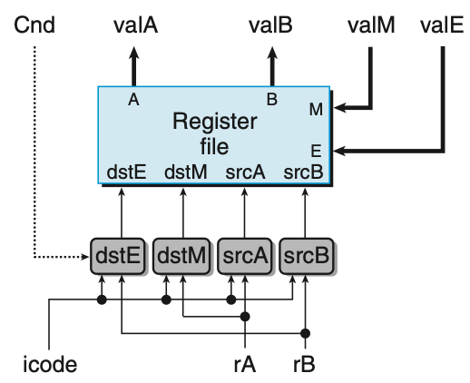
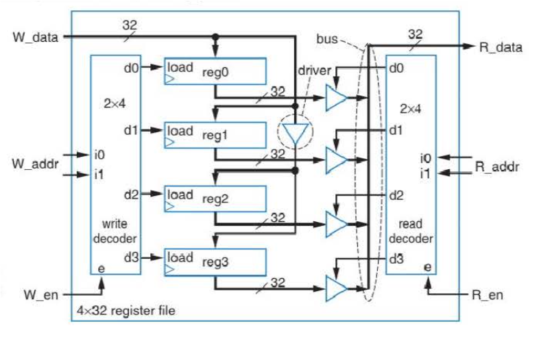

Stage2: Decode and Write Back Stage
===================================================

   Figure 4.28 Register File

Decoding instruction and reading register value
**************************************************

In decode stage, it reads data from register file. The register file has two ports for reads.
::

  Input: srcA and srcB
  Output: valA and valB

It has two ports for writes.

::

  From ALU: dstE and valE
  From Memory: dstM and valM

Register ids are selected by icode. If the fetched instruction does not have to read/write register, select ``0xF``.

.. list-table:: Control logic to generate src/dst registers.

  * - instruction
    - srcA (rA/0x4/0xf)
    - srcB (rB/0x4/0xf)
    - dstE (rB/0x4/0xf)
    - dstM (rA/0xf)

  * - halt
    -
    -
    -
    -

  * - nop
    -
    -
    -
    -
  
  * - rrmovq rA, rB
    -
    -
    -
    -

  * - irmovq V, rB
    -
    -
    -
    -

  * - rmmovq rA, D(rB)
    -
    -
    -
    -

  * - mrmovq D(rB), rA
    -
    -
    -
    -

  * - OPq rA, rB
    -
    -
    -
    -

  * - jXX Dest
    -
    -
    -
    -

  * - cmovXX rA, rB
    -
    -
    -
    -

  * - call Dest
    -
    -
    -
    -

  * - ret
    -
    -
    -
    -

  * - pushq rA
    -
    -
    -
    -

  * - popq rA
    -
    -
    -
    -

Register file implementation
****************************

   Figure 4.79 4x32 reg file (pg. 226) in Vahid book.
