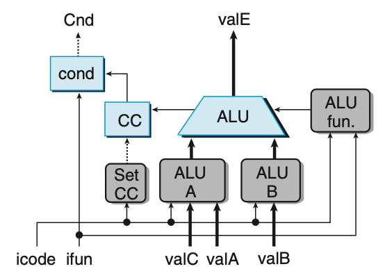
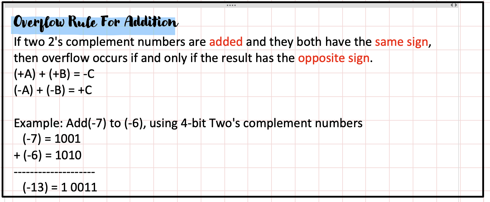
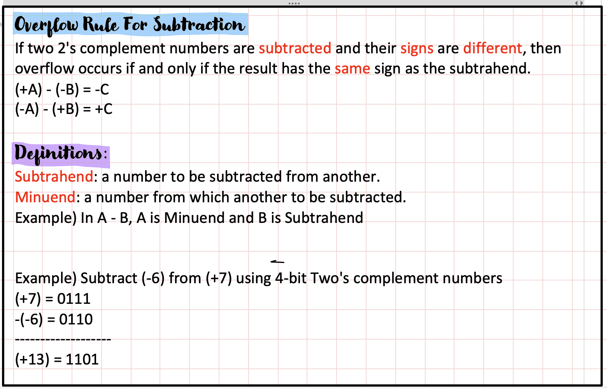
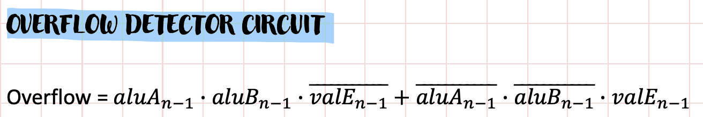

Stage3: Execution Stage
=======================

.. raw:: html

  <iframe width="700" height="400" src="https://www.youtube.com/embed/y_vAGoY3MEM?list=PLAN5AcM4p7jcTwCe-q-A6ziFdvkrXmnGe" title="7 exe" frameborder="0" allow="accelerometer; autoplay; clipboard-write; encrypted-media; gyroscope; picture-in-picture" allowfullscreen></iframe>

.. raw:: html

  <iframe width="700" height="400" src="https://www.youtube.com/embed/uA6qYalSJJo?list=PLAN5AcM4p7jcTwCe-q-A6ziFdvkrXmnGe" title="7 exe demo" frameborder="0" allow="accelerometer; autoplay; clipboard-write; encrypted-media; gyroscope; picture-in-picture" allowfullscreen></iframe>

   Figure 4.29 Execute stage

Arithmetic Logic Unit (ALU) performs the four operations.

:: 

  ADD, SUB, ADN, XOR

Inputs
**********

* ALU_fun:

::

  OP (0,1,2,3) <- ALU_fun(icode, ifun)

* ALU_A:

::

  op1 <- (valC, valB, +8, -8, Z)

* ALU_B:

::

  op2 <- (valB, 0, Z)

Outputs
***********

* valE: op1 OP op2

* ZF/SF/OF: set by OPq instructions

.. list-table:: for t = a + b

  * - CF
    - (unsigned) t < (unsigned) a
    - Unsigned overflow

  * - ZF
    - (t == 0)
    - Zero

  * - SF
    - (t < 0)
    - Negative

  * - OF
    - (a < 0 == b < 0) && ( t < 0 != a < 0)
    - Signed overflow

 
Condition Code (CC) module
***************************

CC stores the last condition code (ZF/SF/OF)

SetCC module
**************

Generate a signal to store CC. It is set if the icode is 6 (``OPq``).

Cond module
**************
The signal of ``Cond`` is used by ``jXX`` in NewPC, ``cmovXX`` in Write Back stage.

::

  Cnd <- Cond(CC, ifun)

.. list-table:: 
  
  * - instruction
    - Synonym
    - Jump condition
    - Description

  * - jmp Label
    - 
    - 1
    - Direct jump

  * - je Label
    - jz
    - ZF
    - Equal / zero

  * - jne Label
    - jnz
    - ~ZF
    - Not equal / not zero

  * - jg Label
    - jnle
    - ~(SF ^ OF) & ~ZF
    - Greater (signed >)

  * - jge Label
    - jnl
    - ~(SF ^ OF)
    - Greater or euqal (signed >=)

  * - jl Label
    - jnge
    - SF ^ OF
    - Less (signed <)

  * - jle Label
    - jng
    - (SF ^ OF) | ZF
    - Less or equal (signed <=)

.. list-table:: Control logic for Execution stage.

  * - instruction
    - ALU_A (valA/valC/-8/8/X)
    - ALU_B (valB/0/X)
    - alufun (0/1/2/3)
    - set_cc (0/1)
    - valE (op1 OP op2)
    - CC (ZF/SF/OF)
    - Cnd (0/1)

  * - halt
    -
    -
    -
    -
    -
    -
    -

  * - nop
    -
    -
    -
    -
    -
    -
    -
  
  * - rrmovq rA, rB
    -
    -
    -
    -
    -
    -
    -

  * - irmovq V, rB
    -
    -
    -
    -
    -
    -
    -

  * - rmmovq rA, D(rB)
    -
    -
    -
    -
    -
    -
    -

  * - mrmovq D(rB), rA
    -
    -
    -
    -
    -
    -
    -

  * - OPq rA, rB
    -
    -
    -
    -
    -
    -
    -

  * - jXX Dest
    -
    -
    -
    -
    -
    -
    -

  * - cmovXX rA, rB
    -
    -
    -
    -
    -
    -
    -

  * - call Dest
    -
    -
    -
    -
    -
    -
    -

  * - ret
    -
    -
    -
    -
    -
    -
    -

  * - pushq rA
    -
    -
    -
    -
    -
    -
    -

  * - popq rA
    -
    -
    -
    -
    -
    -
    -

