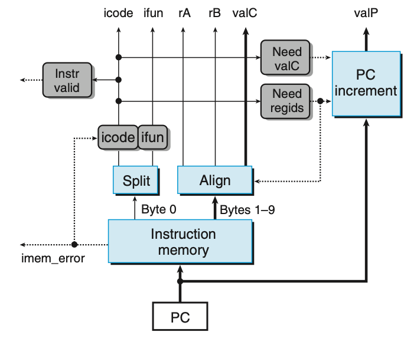
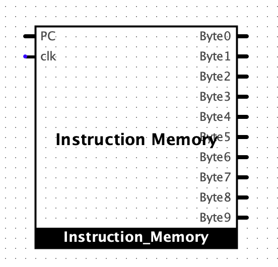

Stage1: Instruction Fetch
======================================

This section explains essential information of Fetch and PC Update Stage.
If you want to find complete description of Fetch Unit and PC Update Stage, read the chapter 4.3.4 SEQ Stage Implementations.

.. raw:: html

   <iframe width="700" height="400" src="https://www.youtube.com/embed/VMdrfKNq4v4?list=PLAN5AcM4p7jcTwCe-q-A6ziFdvkrXmnGe" title="5 fetch" frameborder="0" allow="accelerometer; autoplay; clipboard-write; encrypted-media; gyroscope; picture-in-picture" allowfullscreen></iframe>

.. raw:: html

   <iframe width="700" height="400" src="https://www.youtube.com/embed/UXu98quBMOw?list=PLAN5AcM4p7jcTwCe-q-A6ziFdvkrXmnGe" title="5 fetch demo" frameborder="0" allow="accelerometer; autoplay; clipboard-write; encrypted-media; gyroscope; picture-in-picture" allowfullscreen></iframe>

   Figure 4.27 Fetch stage.

Decoded instruction
************************

As shown in Figure 4.27, the fetch unit includes the instruction memory.
It reads 10 bytes from memory at a time and the address of the first byte is stored in PC.
Then it produces meaningful data and control signal from the instruction for later stages.

::

  icode, ifun, rA, rB, valC

PC increment
*****************

Feth stage calculates one of candidate next PC values ``valP`` in ``PC increment`` module.
Next PC value is decided in PC update stage.

::
  
  valP = PC + 1 + r + 8*i

NeedValC (i)
----------------
It is one bit flag to indicate the current instruction includes valC.

NeedRegids (r)
----------------
It is one bit flag to indicate the current instruction includes register ids.

Instruction memory
--------------------

As mentioned in :doc:`isa`, we use 12-bit of address width, 8-bit of data bit width.
It is byte addressing. Therefore, it's total size of 4 KB.

