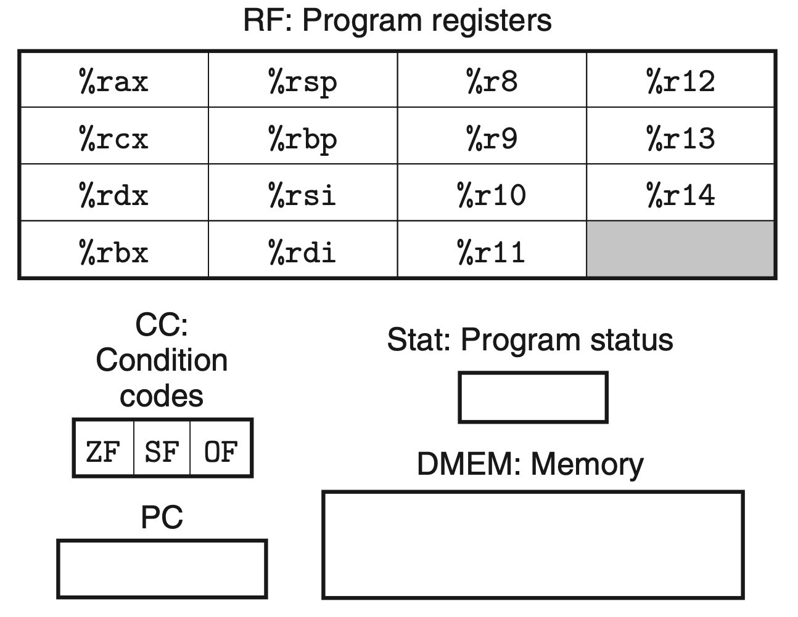
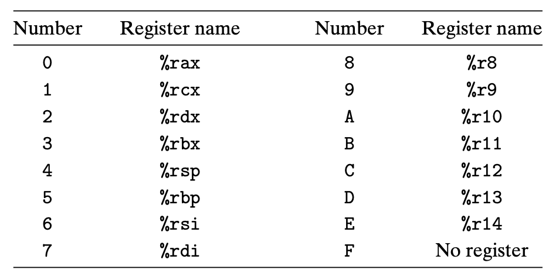
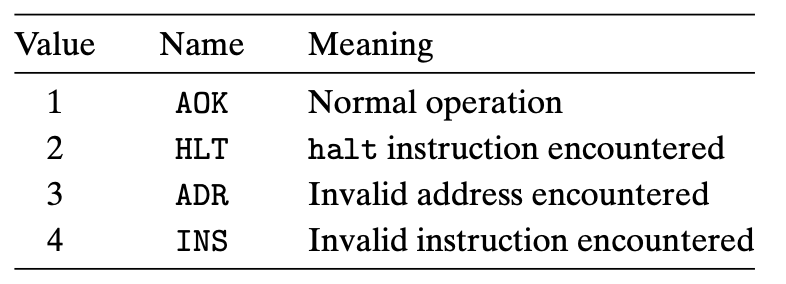

Y86-86 Instruction Set Architecture
========================================================

This document assumes that you are farmiliar with Y86-86 assembly language and its instruction set architecture. 
If you are not or want to review the Y86-86 architecture, refer to the chapter 4.1 of Bryant book.
This document gives you an essential information you should know for Y86-64-SEQ using logisim.

.. raw:: html

  <iframe width="700" height="400" src="https://www.youtube.com/embed/00ePLmsJhhw" title="우리에게 친일파로 그 유명한 이완용! 고종의 신임을 한 몸에 받던 엘리트 수재 친미파였다?! | #벌거벗은한국사 이완용 편" frameborder="0" allow="accelerometer; autoplay; clipboard-write; encrypted-media; gyroscope; picture-in-picture" allowfullscreen></iframe>

1. Programmer Visible State
********************************
Let's start with states that should be provided to the programmer.

Program Counter (PC)
-----------------------
The program counter holds the address of the instruction currently being executed. PC is updated to fetch next instruction at the end of execution by ``PC Update`` stage. We will see how PC is updated in Week1.

Program Registers
--------------------------------

  Figure 4.1

  Figure 4.4

There are 15 registers that Y86-64 program can read and write. Size of each register is 64-bit. All registers can be used for general purpose in the program except %rsp.
Register %rsp is used to point to stack so push, pop, call, and return instruction will update $rsp register. If your program manually change the value of %rsp, it's not guaranteed to execute program correctly.
As shown in Figure 4.4, register name is encoded as integer number in machine code and it is used to read or write from or to the register file.

Memory
--------------------------------
We will include two memory module - one for instruction memory and the other for data memory. This will make Y86-86-SEQ design simpler than having a single memory for both instruction and data. It is definitely okay to use a single memory.
In the textbook, a specification of memory such as address and data bit width is not mentioned but we should define them. As we use logisim for our design and simulation tool, let's use the following properties:

.. list-table:: Memory Specification
   :header-rows: 1

   * - Property
     - Value
   * - Address Bit Width
     - 24-bit
   * - Data Bit Width
     - 8-bit

We use the same specifications for both instruction and data memory. We use 24 bits for memory addressing and this is because the logisim supports 24 bit in maximum. Data bit width is 8-bit and it means that the memory module can read/write 1 bytes per cycles.
For example, it takes 8 cycles to load a data with type ``.quad`` (quadrant word). Again, you can design with different properties as you wish.

Condition codes
--------------------
The Y86-64-SEQ has three single-bit condition code to store zero-flag(ZF), sign-flag(SF), and overflow-flag(OF). It is visible to the program but it is read only.

Program status
-------------------
It stores status codes of program such as normal operation or exceptions as shown in Figure 4.5. If status is not normal (AOK), then the processor halts.

   
  Figure 4.5
