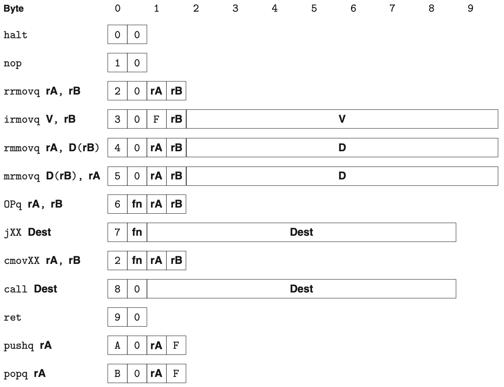
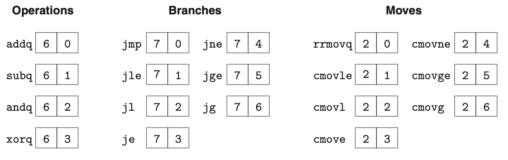

Y86-86 Instruction Set Architecture
========================================================

This document assumes that you are farmiliar with Y86-86 assembly language and its instruction set architecture. 
If you are not or want to review the Y86-86 architecture, refer to the chapter 4.1 of Bryant book.
This document gives you an essential information you should know for Y86-64-SEQ using logisim.

.. raw:: html

   <iframe width="700" height="400" src="https://www.youtube.com/embed/taNteGKWGRs?list=PLAN5AcM4p7jcTwCe-q-A6ziFdvkrXmnGe" title="2 isa2" frameborder="0" allow="accelerometer; autoplay; clipboard-write; encrypted-media; gyroscope; picture-in-picture" allowfullscreen></iframe>

1. Y86-64 Instructions
**************************************
Figure 4.2 and 4.3 list the instructions of Y86-64-SEQ with its format, size, opcode (first byte), function code (second byte).

   
  Figure 4.2

   Figure 4.2

Variable length instruction
--------------------------------------
Y86-64-SEQ has instructions with variable size ranging from 1 byte to 10 bytes. For simple implementation, we fix the number of cycles to fetch the instruction with 10 cycles.

Opcode and Function code in the first byte
--------------------------------------------
In first byte of the insturction, it stores opcoe that is an instruction speicifier and function code that indicates specific integer operation (OPq), data movement condition (cmovXX),
or branch condition (jXX).
``OPq RA, RB`` for an example, two arithmetic (addq and subq) and two logical (andq and xorq) instructions share the same opcode 6 but they have different function code from 0 to 3 (See Figure 4.3).

Register ID in the second byte
--------------------------------------
If instructions include source and destation registers, they are stored in the second byte of the instruction.
First half byte stores the first source operand, and second half byte stores the second source (or destination) operand.
If an insturction have a single operand (pushq, popq), then the second half byte store 0xF indicating no register (Figure 4.4).

Immediate Value from the second or third byte to tenth byte.
-------------------------------------------------------------
Instructions with immediate value (irmovq, rmmovq, mrmovq, jXX, call) store their immediate value from second or third byte 

2. Practice with Test Program (asum.ys)
******************************************
The following Y86-86 assembly is an example code from the Y86-64 student distribution from the authors.
Execute the following assembly code and update Programer visible state.

.. code-block:: asm
  :caption: Sum of array
  :linenos:
  :name: asum

  # Execution begins at address 0
    .pos 0
    irmovq stack, %rsp  	# Set up stack pointer
    call main		# Execute main program
    halt			# Terminate program

  # Array of 4 elements
    .align 8
  array:	.quad 0x000d000d000d
    .quad 0x00c000c000c0
    .quad 0x0b000b000b00
    .quad 0xa000a000a000

  main:	irmovq array,%rdi
    irmovq $4,%rsi
    call sum		# sum(array, 4)
    ret

  # long sum(long *start, long count)
  # start in %rdi, count in %rsi
  sum:	irmovq $8,%r8        # Constant 8
    irmovq $1,%r9	     # Constant 1
    xorq %rax,%rax	     # sum = 0
    andq %rsi,%rsi	     # Set CC
    jmp     test         # Goto test
  loop:	mrmovq (%rdi),%r10   # Get *start
    addq %r10,%rax       # Add to sum
    addq %r8,%rdi        # start++
    subq %r9,%rsi        # count--.  Set CC
  test:	jne    loop          # Stop when 0
    ret                  # Return

  # Stack starts here and grows to lower addresses
    .pos 0x200
  stack:

.. code-block:: bash
  :caption: Programer Visible Status After running asum.yo

    > yis asum.yo
    Stopped in 34 steps at PC = 0x13.  Status 'HLT', CC Z=1 S=0 O=0
    Changes to registers:
    %rax:	0x0000000000000000	0x0000abcdabcdabcd
    %rsp:	0x0000000000000000	0x0000000000000200
    %rdi:	0x0000000000000000	0x0000000000000038
    %r8:	0x0000000000000000	0x0000000000000008
    %r9:	0x0000000000000000	0x0000000000000001
    %r10:	0x0000000000000000	0x0000a000a000a000

    Changes to memory:
    0x01f0:	0x0000000000000000	0x0000000000000055
    0x01f8:	0x0000000000000000	0x0000000000000013
