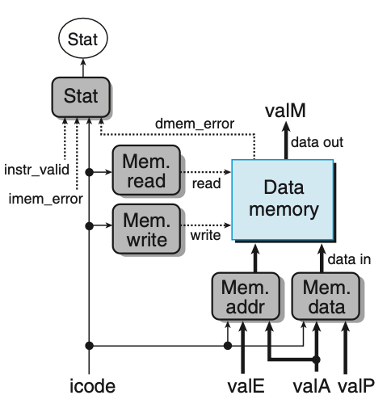

Stage4: Memory Stage
=====================

   Figure 4.30 Memory stage

.. list-table:: Control logic for Execution stage.

  * - instruction
    - Mem. read (1: read)
    - Mem. write (1: write)
    - Mem. addr (valE/valA)
    - Mem. Data (valA/valP)

  * - halt
    -
    -
    -
    -

  * - nop
    -
    -
    -
    -
  
  * - rrmovq rA, rB
    -
    -
    -
    -

  * - irmovq V, rB
    -
    -
    -
    -

  * - rmmovq rA, D(rB)
    -
    -
    -
    -

  * - mrmovq D(rB), rA
    -
    -
    -
    -

  * - OPq rA, rB
    -
    -
    -
    -

  * - jXX Dest
    -
    -
    -
    -

  * - cmovXX rA, rB
    -
    -
    -
    -

  * - call Dest
    -
    -
    -
    -

  * - ret
    -
    -
    -
    -

  * - pushq rA
    -
    -
    -
    -

  * - popq rA
    -
    -
    -
    -
