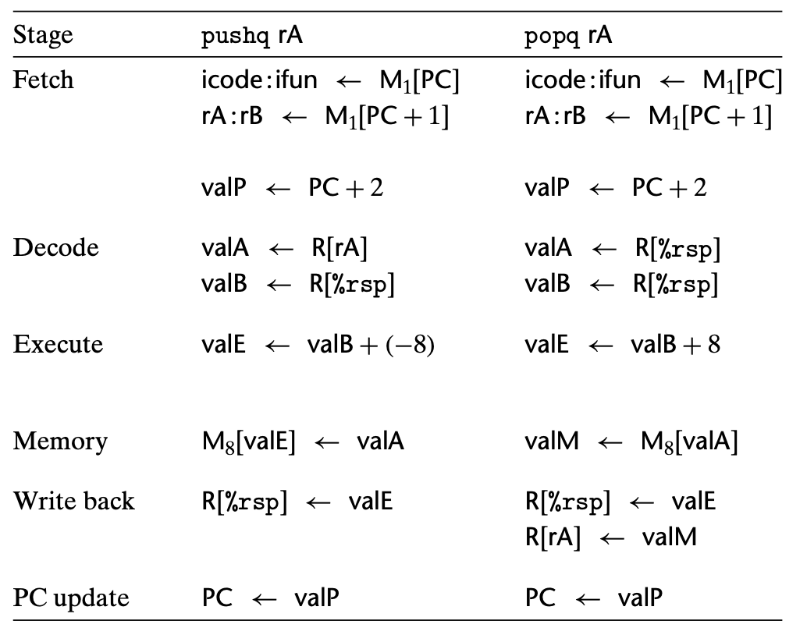
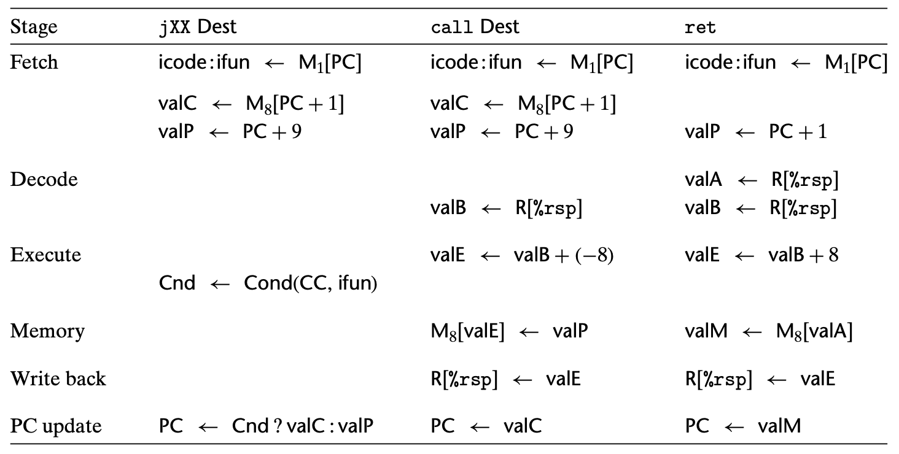
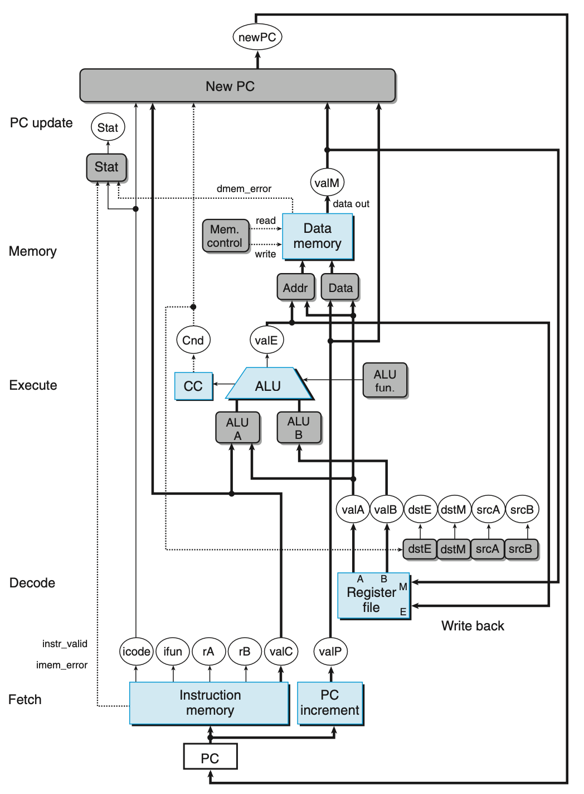

Y86-64 Sequential Implementation
==================================

This section overview the Y86-64 sequential implementation. We assume that you have learned data path of Y86-64 SEQ in the lecture.
If you wan to review the Y86-64 SEQ data path, you can read the Chapter 4.3 of Bryant book. This section lists important figures for the implementation.

 
.. figure:: ./images/fig4.18.png

  Figure 4.18

.. figure:: ./images/fig4.19.png

  Figure 4.19

  Figure 4.20

  Figure 4.21

  Figure 4.23

.. figure:: ./images/prob4.17.png

  Problem 4.17

